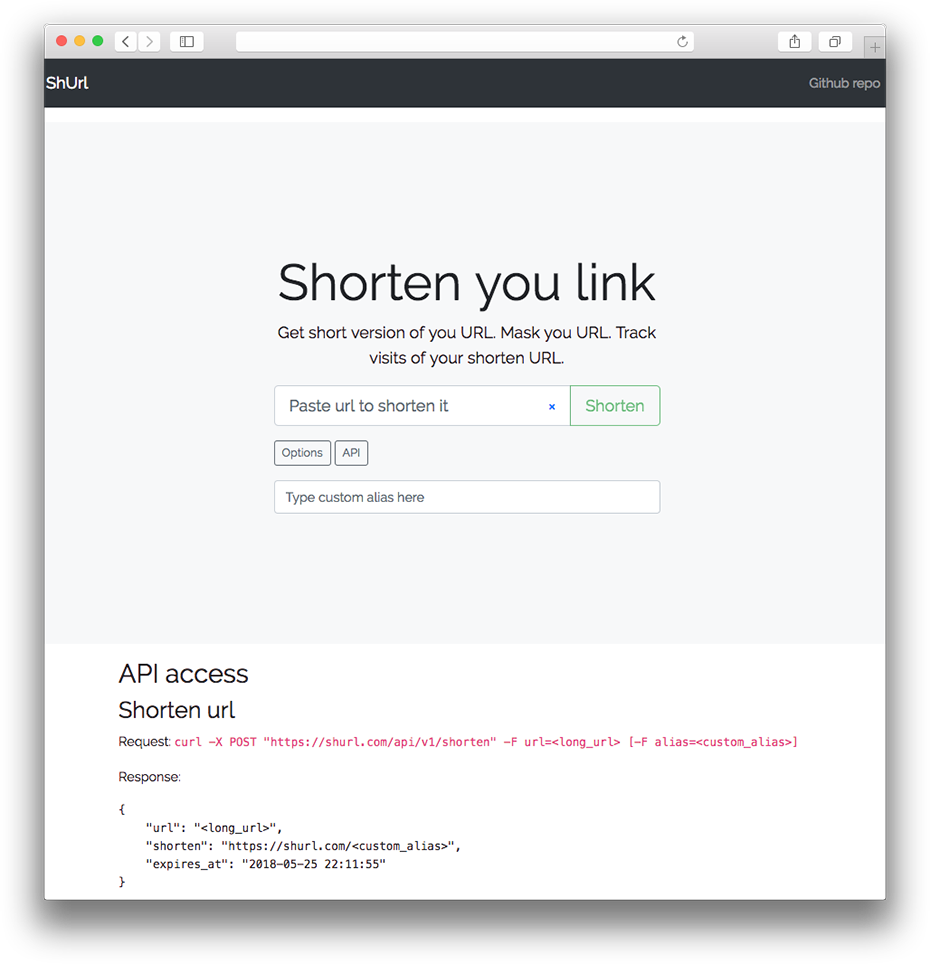

# Demo URL Shortener

Project based on [Laravel framework](https://laravel.com/) and [Twitter Bootstrap 4](https://getbootstrap.com/)

## Software Requirements
- PHP >= 7.1.3
  - OpenSSL PHP Extension
  - PDO PHP Extension
  - Mbstring PHP Extension
  - Tokenizer PHP Extension
  - XML PHP Extension
  - Ctype PHP Extension
  - JSON PHP Extension
- MySQL

## Development deploy
- Clone repository `git clone git://github.com/pashamesh/shurl && cd shurl`
- Configure `.env` file `cp .env.example .env && vi .env`
- Install Composer dependencies `composer install`
- Run Database migrations `php artisan migrate`
